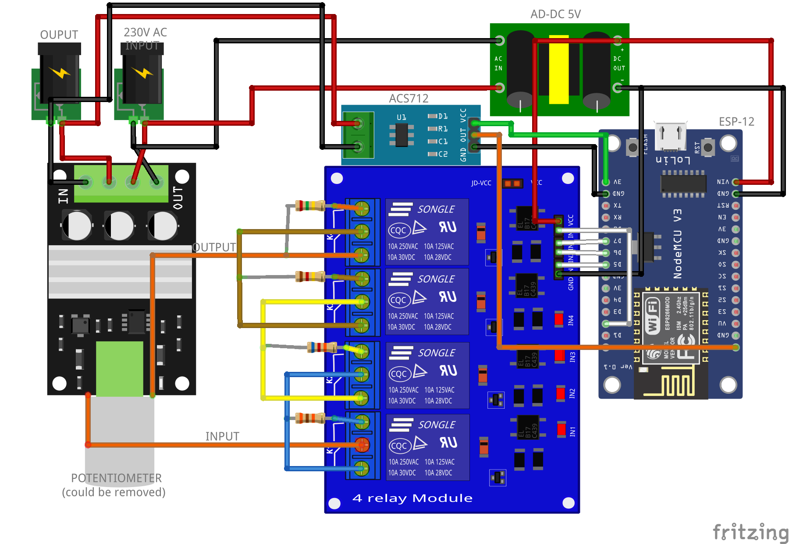

# elektroniczny-potencjometr
Urządzenie zastępujące fizyczny potencjometr przekaźnikami eletrycznymi sterowanymi przez ESP-012. 

#  Diagram
|  |
| -------------------------------------------------------------- |

### Wymagane Elementy
- ESP-12
- ACS712
- AD-DC 5V
- Moduł 4 przekaźników magnetycznych
- Regulator mocy obrotów silnika 230V AC
